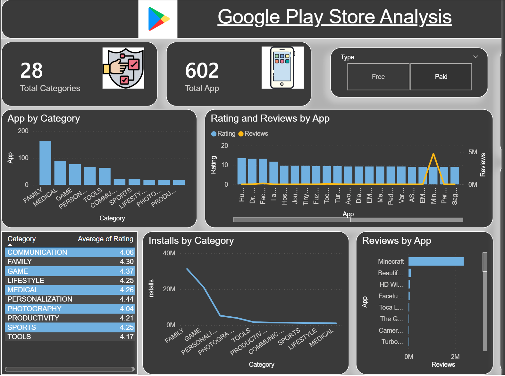

# Google-Apps-Insights-Analytics-PowerBI

## Overview

This interactive Power BI dashboard explores a dataset of 10,350 Google Play Store applications, representing a combined 147 billion installs. It offers visual insights into market share distribution, the trajectory of app success, performance across categories, and content rating trends—empowering stakeholders to make informed, strategic decisions in app development, positioning, and marketing.

---

## Dataset

This analysis is based on a refined dataset of **10,350 Google Play Store applications**, meticulously cleaned and preprocessed using Python to ensure data quality and consistency. The cleaned dataset (`googleplaystore.csv`) was generated from the Jupyter notebook `Google_Play_Store_Analytics_Cleaned`, which standardized formats, resolved inconsistencies, and handled missing values. Key metrics reveal an **average app rating of 4.19**, a staggering **147 billion total installs**, and a strong signal of user satisfaction—**84% of apps show a positive rating trend**, backed by comprehensive review-based performance scoring. The dataset provides deep coverage across major categories including **GAME, COMMUNICATION, SOCIAL, PRODUCTIVITY, TOOLS, FAMILY**, and others, with detailed install breakdowns for market share analysis. To understand app growth trajectories, applications are segmented along a success journey: from **All Apps (10K)** to those **With Reviews (94.29%)**, then to **Popular (1K+ installs, 74.13%)**, **Successful (100K+ installs, 44.16%)**, **Top Tier (10M+ installs, 7.26%)**, and finally **Elite (100M+ installs, 1.06%)**. Content ratings are distributed as follows: **Everyone (50.68%)**, **Teen (20.83%)**, **Mature 17+ (14.98%)**, **Everyone 10+ (12.51%)**, with minimal representation in **Adults Only 18+** and **Unrated** categories. With its massive scale and granular structure, this dataset offers a robust foundation for benchmarking performance and deriving strategic insights into the Android app marketplace.

---

## Analysis Outcome

  - Cleaned and transformed the raw Google Play Store dataset using Python in the notebook `Google_Play_Store_Analytics_Cleaned`, removing duplicates, normalizing install ranges, and converting file sizes to megabytes (MB).  
  - Exported the processed data to `googleplaystore.csv` with appropriate data types and validated fields to ensure seamless integration and compatibility with Power BI.  
  - Developed custom calculated columns and DAX measures in Power BI to support key metrics such as Review Performance Score, success-tier classifications, and market share percentages.
  - Designed a scatter plot to explore the relationship between **number of reviews and average rating**, spotlighting high-engagement apps with strong user satisfaction.  
  - Created a stacked bar chart visualizing **app size distribution across content rating categories**, showing that the “Everyone” group leads with approximately 450 apps.  
  - Integrated interactive slicers for **Content Rating** (e.g., Everyone, Teen, Mature 17+, Everyone 10+) to enable targeted demographic analysis.  
  - Applied consistent color-coding—using green/red indicators for performance trends—and a professional Power BI theme to enhance readability and visual cohesion.

---

## Dashboard 

- This Power BI dashboard delivers a comprehensive performance analysis of **9.63K Google Play Store apps**, with **147 billion total installs** and an **average rating of 4.19**, offering strategic insights for app developers and marketers.
- Key metrics include **406.33K average reviews per app**, highlighting user engagement levels across the ecosystem.
- The **Apps Updated Over Time** area chart tracks category-wise evolution from 2010–2018, revealing trends such as the rise of COMMUNICATION and decline of DATING apps over time.
- A bar chart titled **Categories by Performance** ranks categories by install volume, showing GAME as the top performer, followed by COMMUNICATION and SOCIAL—critical segments for investment and optimization.
- The **Free vs Paid Apps** visualization compares rating sums, indicating that while free apps dominate in volume, paid apps often maintain higher aggregate ratings.
- The **Rating Distribution Analysis** table breaks down ratings by content rating and pricing model, revealing that “Everyone” and “Teen” categories drive most of the cumulative rating scores.
- An interactive **Top Apps by Rating & Reviews** chart highlights high-performing titles like ROBLOX and Subway Surfers, correlating strong ratings with massive review volumes.
- Designed for product strategists and growth teams to identify market leaders, optimize monetization models, and prioritize development based on data-backed performance trends.

---

---

## Author & Contact
- Name: `Kshitij Saini`  
- LinkedIn: [https://www.linkedin.com/in/kshitijsaini](https://www.linkedin.com/in/kshitij-saini-b950b7299?utm_source=share_via&utm_content=profile&utm_medium=member_android)
